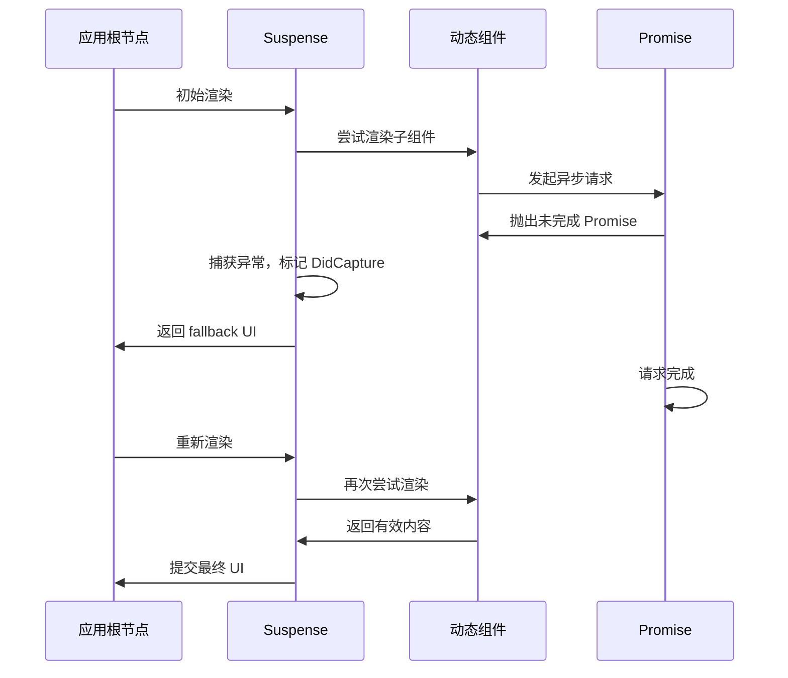
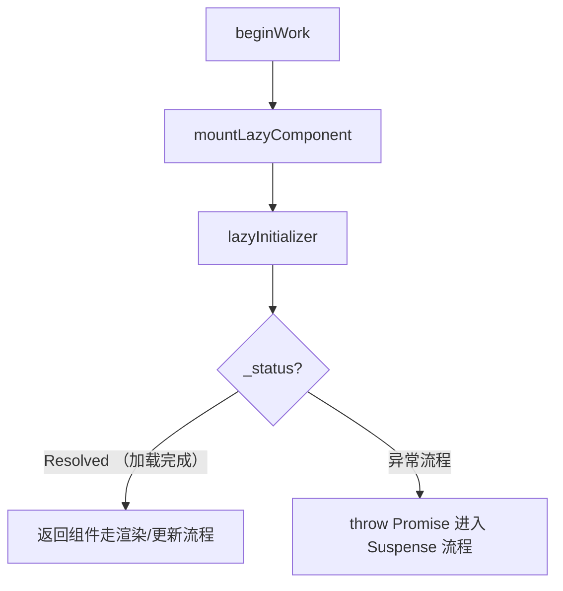

## 前言

由于之前在看 `React` 新的变化时，注意到关于 `use` 带来的一些改变（之前在用 `Suspense` 去做组件的异步加载使用到了一些 `hack` 写法）。
为了更好的理解 `React` 底层机制和实际应用，本文将对 `Suspense` 与 `lazy` 的基本用法进行介绍，同时剖析下内部实现原理，包括错误捕获、状态管理及重渲染流程。

> 本文代码全部基于 React 最新版本 **V19.0.0**，与之前 V18+ 可能存在差异，具体可以查看 [React](https://github.com/facebook/react) 斧正。

## Suspense

### 基本概念与用法

`Suspense` 在 `React` 官网定义是 **Suspense 允许在子组件完成加载前展示后备方案**，常见用法是使用 `lazy` ，去做异步组件的加载。例如：

```ts
import { Suspense, lazy } from "react"

const LazyComponent = lazy(() => import("./SomeComponent"))

const App = () => {
  return (
    <Suspense fallback={<div>Loading...</div>}>
      <LazyComponent />
    </Suspense>
  )
}
```

在老版本 `React` 中，如果你要使用 `Suspense` 去做接口层面的处理，比如你需要在接口返回之后展示真实 UI，这时候你或许需要一些 `hack` 写法，但需要注意的是这并不是推荐行为：

> `Suspense` 的作用是为了统一处理异步加载，而不是仅仅处理 `lazy` 作用于代码分割，将异步状态收口到框架本身是其最终目的，具体可以参考[^1]。

### 异步模拟

下方是的例子是通过模拟 `lazy` 本身的行为，完成接口数据的获取，并将数据通过 `props` 进行传递：

```ts
// 模拟异步数据请求
function fetchData() {
  return new Promise((resolve) => {
    setTimeout(() => {
      resolve({ message: "Hello from API" });
    }, 2000);
  });
}

// 使用 lazy 进行动态加载，并将数据作为 props 传递
const Component = lazy(() =>
  fetchData().then((data) => ({
    default: () => <SomeComponent data={data} />,
  }))
);

```

另外，你也可以通过 `throw` 的形式，去模拟 `lazy` 的异常行为，例如：

```ts
function wrapPromise<T>(promise: Promise<T>) {
  let status = 'pending'
  let result: T
  let suspender = promise.then(
    (r) => {
      status = 'success'
      result = r
    },
    (e) => {
      status = 'error'
      result = e
    }
  )

  return {
    read() {
      if (status === 'pending') throw suspender
      if (status === 'error') throw result
      return result
    },
  }
}
```

不过上面那些模拟的行为，在最新版本中都得以改善，你可以通过最新的 API `use` 来完成数据的获取以及异常时重启调度行为，具体请参考参考 `use` 的官方说明[^2]：

> `use` 它可以用来读取 `Promise` 或者 `context` 的值，与 `Hooks` 的区别是，它可以放入循环与条件语句，但是必须在 `Hooks` 与组件内使用，且要注意的是，你需要保证 `Promise` 的**唯一性**。

```ts
import { Suspense, use } from 'react'

const InnerComponent = ({ promise }) => {
  const message = use(promise)
  return <>message is {message}</>
}
```

### Suspense 内部实现

#### 工作流程概述

从内部实现来看，`Suspense` 的工作流程大致如下：

##### 1. 初次渲染时

子组件因异步加载而触发异常（通过 `throw Promise`），此时 `Suspense` 捕获该异常并展示 `Fallback` UI。

##### 2. 异步加载完成

当 `Promise` 完成后，`React` 重新调度渲染，替换为真实 UI。

在 `Suspense` 内部实现就是通过 `showFallback` 来进行控制的，具体代码在 <mark>ReactFiberBeginWork.js</mark> 中：

```ts filename="ReactFiberBeginWork.js"
function updateSuspenseComponent(current: null | Fiber, workInProgress: Fiber, renderLanes: Lanes) {
  const nextProps = workInProgress.pendingProps

  let showFallback = false
  const didSuspend = (workInProgress.flags & DidCapture) !== NoFlags
  if (didSuspend || shouldRemainOnFallback(current, workInProgress, renderLanes)) {
    showFallback = true
    workInProgress.flags &= ~DidCapture
  }

  const didPrimaryChildrenDefer = (workInProgress.flags & DidDefer) !== NoFlags
  workInProgress.flags &= ~DidDefer

  if (current === null) {
    // 挂载流程
    const nextPrimaryChildren = nextProps.children
    const nextFallbackChildren = nextProps.fallback
    if (showFallback) {
      const fallbackFragment = mountSuspenseFallbackChildren(
        workInProgress,
        nextPrimaryChildren,
        nextFallbackChildren,
        renderLanes
      )
      return fallbackFragment
    } else {
      return mountSuspensePrimaryChildren(workInProgress, nextPrimaryChildren, renderLanes)
    }
  } else {
    // 更新流程
    if (showFallback) {
      const nextFallbackChildren = nextProps.fallback
      const nextPrimaryChildren = nextProps.children
      const fallbackChildFragment = updateSuspenseFallbackChildren(
        current,
        workInProgress,
        nextPrimaryChildren,
        nextFallbackChildren,
        renderLanes
      )
      return fallbackChildFragment
    } else {
      const nextPrimaryChildren = nextProps.children
      const primaryChildFragment = updateSuspensePrimaryChildren(
        current,
        workInProgress,
        nextPrimaryChildren,
        renderLanes
      )
      workInProgress.memoizedState = null
      return primaryChildFragment
    }
  }
}
```

#### 异常捕获与重新调度

那么 `React` 内部是怎么完成 `showFallback` 的切换的呢？，是通过异常处理机制来捕获 `throw` 抛出的 `Promise`，最终在 `Promise` 完成加载时，显示真实的 UI。具体可以参考 <mark>ReactFiberWorkLoop.js</mark> 中的 `handleThrow`：

```ts filename="ReactFiberWorkLoop.js"
outer: do {
  try {
    if (workInProgressSuspendedReason !== NotSuspended && workInProgress !== null) {
      const unitOfWork = workInProgress
      const thrownValue = workInProgressThrownValue
      resumeOrUnwind: switch (workInProgressSuspendedReason) {
        // 省略代码
        case SuspendedOnDeprecatedThrowPromise: {
          workInProgressSuspendedReason = NotSuspended
          workInProgressThrownValue = null
          throwAndUnwindWorkLoop(root, unitOfWork, thrownValue, SuspendedOnDeprecatedThrowPromise)
          break
        }
        // 省略代码
      }
    }
    // 省略代码
    workLoopConcurrent() // 👈 使用 Suspense 节点重新开始 beginWork
    break
  } catch (thrownValue) {
    handleThrow(root, thrownValue) // 👈 catch throw promise
  }
} while (true)
```

而 `handleThrow` 内部则是通过判断 `thrownValue` 来进行 `workInProgressSuspendedReason` 的赋值操作，在 `workLoop` 流程中，我们可以看到 `workInProgressSuspendedReason` 的相应处理。

```ts filename="ReactFiberWorkLoop.js"
function handleThrow(root: FiberRoot, thrownValue: any): void {
  // 省略代码

  const isWakeable =
    thrownValue !== null &&
    typeof thrownValue === 'object' &&
    typeof thrownValue.then === 'function'

  workInProgressSuspendedReason = isWakeable ? SuspendedOnDeprecatedThrowPromise : SuspendedOnError // 👈 作为后续依据去走 throwAndUnwindWorkLoop 流程

  workInProgressThrownValue = thrownValue

  // 省略代码
}
```

`throwAndUnwindWorkLoop` 内部完成了三件事：

1. `Suspense` `Fiber` 节点的 `flags` 标记（ `ShouldCapture` ），作为 `Fallback` 切换的标志位；
2. 调度流程的重新发起发起；
3. 完成 `Fiber` 树的 `flags` 合并；

```ts
// ReactFiberWorkLoop.js
function throwAndUnwindWorkLoop(
  root: FiberRoot,
  unitOfWork: Fiber,
  thrownValue: mixed,
  suspendedReason: SuspendedReason
) {
  const returnFiber = unitOfWork.return
  try {
    const didFatal = throwException(
      root,
      returnFiber,
      unitOfWork,
      thrownValue,
      workInProgressRootRenderLanes
    )
  } catch (error) {}

  if (unitOfWork.flags & Incomplete) {
    unwindUnitOfWork(unitOfWork, skipSiblings) // 👈 从 throw 节点向上到最近的 Suspense Fiber 节点，完成 flags 合并工作
  } else {
    completeUnitOfWork(unitOfWork)
  }
}

// ReactFiberThrow.js
function throwException(
  root: FiberRoot,
  returnFiber: Fiber | null,
  sourceFiber: Fiber,
  value: mixed,
  rootRenderLanes: Lanes
): boolean {
  sourceFiber.flags |= Incomplete

  if (value !== null && typeof value === 'object') {
    if (typeof value.then === 'function') {
      const wakeable: Wakeable = (value: any)

      const suspenseBoundary = getSuspenseHandler()
      if (suspenseBoundary !== null) {
        switch (suspenseBoundary.tag) {
          case SuspenseComponent: {
            markSuspenseBoundaryShouldCapture( // 👈 ShouldCapture flags 标记
              suspenseBoundary,
              returnFiber,
              sourceFiber,
              root,
              rootRenderLanes,
            );
            // 省略
            const retryQueue: RetryQueue | null = (suspenseBoundary.updateQueue: any)
            if (retryQueue === null) {
              suspenseBoundary.updateQueue = new Set([wakeable])
            } else {
              retryQueue.add(wakeable)
            }

            if (disableLegacyMode || suspenseBoundary.mode & ConcurrentMode) {
              attachPingListener(root, wakeable, rootRenderLanes) // 👈 重启调度流程
            }
            return false
          }
        }
      } else {
        // 省略
      }
    }
  }

  return false
}
```

最后，可以用一个序列图来描述这个过程：

1. 初次渲染时，`Suspense` 加载组件，这时候组件由于异步加载 `throw Promise` 去走异常流程；
2. `React` 捕获到异常流程之后开始 `flags` 标记、重新调度；
3. 重新调度之后完成 `Fallback` 组件的展示；
4. 异步组件加载完成，切换真实的 UI；



## lazy

### 内部实现

`lazy` 接受一个返回 `Promise` 或者 `thenable` 函数，它的常用场景就是搭配 `import` 动态导入，来实现代码分割，并利用 `Suspense` 来处理加载状态。
在其内部实现中，可以认为它类似于一个状态机，根据加载进度切换不同的状态来管理组件加载的过程。

#### 1. 核心结构

```js filename="ReactLazy.js"
function lazy<T>(
  ctor: () => Thenable<{default: T, ...}>,
): LazyComponent<T, Payload<T>> {
  const payload: Payload<T> = {
    _status: Uninitialized,
    _result: ctor,
  };

  const lazyType: LazyComponent<T, Payload<T>> = {
    $$typeof: REACT_LAZY_TYPE,
    _payload: payload,
    _init: lazyInitializer,
  };

  return lazyType;
}
```

#### 2. 状态机制

```js filename="ReactLazy.js"
const Uninitialized = -1
const Pending = 0
const Resolved = 1
const Rejected = 2
```

#### 3. 初始化入口

```ts filename="ReactLazy.js"
function lazyInitializer<T>(payload: Payload<T>): T {
  if (payload._status === Uninitialized) {
    const ctor = payload._result;
    const thenable = ctor();
    thenable.then(
      moduleObject => {
        if (
          (payload: Payload<T>)._status === Pending ||
          payload._status === Uninitialized
        ) {
          const resolved: ResolvedPayload<T> = (payload: any);
          resolved._status = Resolved;
          resolved._result = moduleObject;
        }
      },
      error => {
        if (
          (payload: Payload<T>)._status === Pending ||
          payload._status === Uninitialized
        ) {
          const rejected: RejectedPayload = (payload: any);
          rejected._status = Rejected;
          rejected._result = error;
        }
      },
    );
  }
  if (payload._status === Resolved) {
    const moduleObject = payload._result;
    return moduleObject.default;
  } else {
    throw payload._result;
  }
}
```

#### 4. 加载流程

可以看到的是，`lazy` 组件的加载流程是根据 `lazyInitializer` 中 `payload` 的状态从而返回组件或者是 `throw` 一个异常去走 `Suspense` 流程，完成组件与备用组件的渲染切换。

```ts filename="ReactFiberBeginWork.js"
function mountLazyComponent(
  _current: null | Fiber,
  workInProgress: Fiber,
  elementType: any,
  renderLanes: Lanes
) {
  const props = workInProgress.pendingProps
  const lazyComponent: LazyComponentType<any, any> = elementType
  let Component

  const payload = lazyComponent._payload
  const init = lazyComponent._init
  Component = init(payload)
  workInProgress.type = Component

  // 加载完成省略
}
```

下面的流程图描述了 `lazy` 组件在 `beginWork` 阶段的加载过程：



[^1]: [0213-suspense-in-react-18.md](https://github.com/reactjs/rfcs/blob/main/text/0213-suspense-in-react-18.md)

[^2]: [React use](https://zh-hans.react.dev/reference/react/use)
