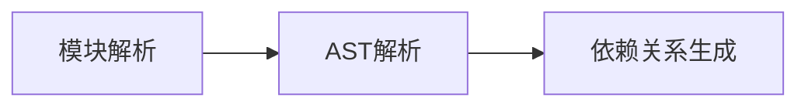

## 前言

`Webpack` 从 **V2** 版本支持 Tree Shaking，其目的是在打包过程中，消除代码中未使用的死代码，以减小最终构建产物的大小。
类似于 `DCE`[^1]，Tree Shaking 同样是一种死代码消除，区别是相对于传统的 `DCE` 基于代码流分析，`Tree Shaking` 是作用于模块级别的，基于 `ESM` 的静态分析能力。
在介绍 `Webpack` Tree Shaking 之前，我们先来简单回顾下 `ESM` 与 `CJS` 的使用以及它们之间的区别。

## 区别

### CommonJS

`CommonJS` 是一个专门为服务端设计的模块化规范，其主要实现是 `NodeJS`。它规定每一个文件都是一个独立的模块，拥有着自己独立的作用域。模块通过 `require` 导入，它支持路径运行时计算，其依赖关系无法在编译时确定。

```js
const env = process.env.NODE_ENV || 'prod'

const path = env === 'prod' ? './prod.js' : './dev.js'

const config = require(path)
```

使用 `exports` / `module.exports` 导出内部成员。

```js
// 动态导出示例
if (condition) {
  module.exports = { funcA }
} else {
  module.exports = { funcB }
}
```

`Webpack` 无法在构建阶段准确追踪动态导出和导入的引用关系，因此 无法对 `CJS` 模块实施 Tree Shaking。

### ES Module

`ESM` 又称 `ES Module`，是 `ECMAScript` 标准引入的模块化规范，相对于 `CommonJS` 是动态导入，`ESM` 的模块是静态的，可以在编译时就确定其依赖关系。它采用 `import` / `export` 来导入/导出成员，它们必须在顶层声明（不能在条件语句里）。

```js
// 静态导入导出（可分析）
import { utils } from './lib.js' // ✅ 路径为字面量
export const PI = 3.14 // ✅ 顶层声明
```

> ESM 同样支持动态导入，具体参考 import() [^2]，不过由于其动态性**可能**会影响 Tree Shaking，值得注意的是，字面量路径的动态导入不会影响 Tree Shaking。

```js
// math.js
export const add = (a, b) => a + b
export const multiply = (a, b) => a * b

// 动态导入（仅使用 add）
import('./math.js').then(({ add }) => add(2, 3))
```

静态结构允许构建工具在打包时精确建立模块依赖图谱，识别未被引用的导出项，为代码消除提供必要条件。

通过对比可见，`ESM` 的静态模块特性是 Tree Shaking 能够实现的技术基石。接下来我们将深入解析 `Webpack` 实现 Tree Shaking 的具体工作机制。

## Webpack Tree Shaking 流程解析

`Webpack` 的 Tree Shaking 实现可分为三个关键阶段：

### 1. 依赖图谱构建阶段



## 优化 Tree shaking 的建议

1. 确保使用 `ESM`: 只有 `ESM` 模块是静态的，Tree shaking 才能正常工作。尽量使用 `import` 和 `export`，避免使用 `CommonJS` 模块。
2. 标记副作用: 在 `package.json` 中使用 `sideEffects` 字段，告知打包工具哪些模块是无副作用的，这样可以更好地执行 Tree shaking。
3. 避免动态代码: 动态导入和动态依赖（如 `require()`）会阻碍 Tree shaking 的工作，尽量避免这些模式。

[^1]: [DCE](https://zh.wikipedia.org/wiki/%E6%AD%BB%E7%A2%BC%E5%88%AA%E9%99%A4)

[^2]: [import 动态导入](https://developer.mozilla.org/zh-CN/docs/Web/JavaScript/Reference/Operators/import)
