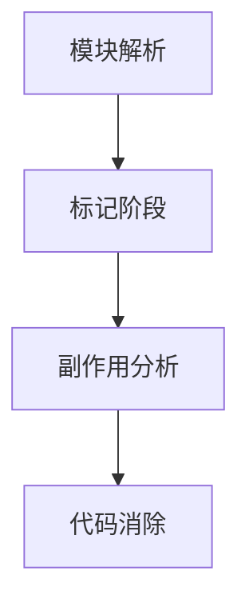
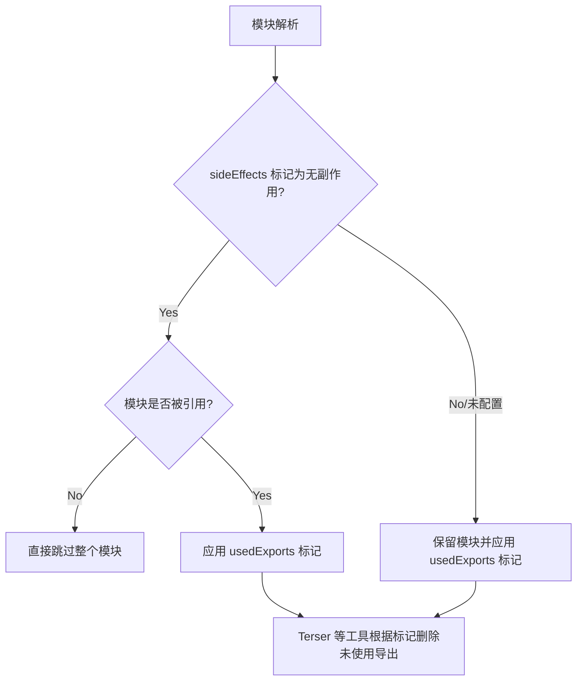

## 前言

`Webpack` 从 **V2** 版本支持 Tree Shaking，其目的是在打包过程中，消除代码中未使用的死代码，以减小最终构建产物的大小。
类似于 `DCE`[^1]，Tree Shaking 同样是一种死代码消除，区别是相对于传统的 `DCE` 基于代码流分析，`Tree Shaking` 是作用于模块级别的，基于 `ESM` 的静态分析能力。
在介绍 `Webpack` Tree Shaking 之前，我们先来简单回顾下 `ESM` 与 `CJS` 的使用以及它们之间的区别。

## 区别

### CommonJS

`CommonJS` 是一个专门为服务端设计的模块化规范，其主要实现是 `NodeJS`。它规定每一个文件都是一个独立的模块，拥有着自己独立的作用域。模块通过 `require` 导入，它支持路径运行时计算，其依赖关系无法在编译时确定。

```js
const env = process.env.NODE_ENV || 'prod'

const path = env === 'prod' ? './prod.js' : './dev.js'

const config = require(path)
```

使用 `exports` / `module.exports` 导出内部成员。

```js
// 动态导出示例
if (condition) {
  module.exports = { funcA }
} else {
  module.exports = { funcB }
}
```

`Webpack` 无法在构建阶段准确追踪动态导出和导入的引用关系，因此 无法对 `CJS` 模块实施 Tree Shaking。

### ES Module

`ESM` 又称 `ES Module`，是 `ECMAScript` 标准引入的模块化规范，相对于 `CommonJS` 是动态导入，`ESM` 的模块是静态的，可以在编译时就确定其依赖关系。它采用 `import` / `export` 来导入/导出成员，它们必须在顶层声明（不能在条件语句里）。

```js
// 静态导入导出（可分析）
import { utils } from './lib.js' // ✅ 路径为字面量
export const PI = 3.14 // ✅ 顶层声明
```

> ESM 同样支持动态导入，具体参考 import() [^2]，不过由于其动态性**可能**会影响 Tree Shaking，值得注意的是，字面量路径的动态导入不会影响 Tree Shaking。

```js
// math.js
export const add = (a, b) => a + b
export const multiply = (a, b) => a * b

// 动态导入（仅使用 add）
import('./math.js').then(({ add }) => add(2, 3))
```

静态结构允许构建工具在打包时精确建立模块依赖图谱，识别未被引用的导出项，为代码消除提供必要条件。

通过对比可见，`ESM` 的静态模块特性是 Tree Shaking 能够实现的技术基石。接下来我们将深入解析 `Webpack` 实现 Tree Shaking 的具体工作机制。

## Webpack Tree Shaking 流程解析

`Webpack` 的 Tree Shaking 实现可分为四个关键阶段，详细可以参考[^3]：



### 1.模块解析阶段

- 构建模块依赖图谱
- 识别所有导出项（`harmony exports`）
- 记录导入引用关系

### 2.标记阶段

```js
   /***/ (__unused_webpack_module, __unused_webpack___webpack_exports__, __webpack_require__) => {
      eval(
        '/* harmony import */ var _utils__WEBPACK_IMPORTED_MODULE_1__ = __webpack_require__(/*! ./utils */ "./src/utils.js");\n/* harmony import */ var _side_effect__WEBPACK_IMPORTED_MODULE_0__ = __webpack_require__(/*! ./side-effect */ "./src/side-effect.js");\n\n\n\nconsole.log((0,_utils__WEBPACK_IMPORTED_MODULE_1__.add)(2, 3));\n\n\n//# sourceURL=webpack://webpack/./src/index.js?'
      )

      /***/
    },
```

- 遍历所有导出项
- 标记被引用的导出为 `harmony export`
- 未引用项标记为 `unused harmony export`

### 3.副作用分析

- 默认认为所有模块都有副作用
- 通过配置声明无副作用模块
- 对无副作用且无引用的模块进行删除

```json filename="package.json"
{
  "sideEffects": ["./src/side-effects.js"]
}
```

> `Webpack` 会根据 `package.json` / `module.rules` 的 `sideEffects` 的配置来判断哪些文件具有副作用，可以通过设置 `sideEffects` 来告知 `Webpack` 安心的删除未使用到的代码。

### 4.代码消除阶段

- 删除未被标记的导出声明
- 移除无副作用未引用模块
- 保留有副作用的未引用模块

### 代码演示

```js
// utils.js
export const add = (a, b) => a + b
export const sub = (a, b) => a - b // 该函数不会被使用

// index.js
import { add } from './utils'
import './side-effect'

console.log(add(2, 3))

// side-effect.js
export const say = (name) => {
  console.log(name)
  return name
}
window.x = 'sideEffect'
```

```js filename="webpack.config.js"
module.exports = {
  mode: 'development',
  optimization: {
    usedExports: true,
  },
}
```

可以看到，当我们设置 `mode` 为 `development` 时，此时的构建产物出现了 `harmony` / `unused harmony` 的标记，
你可以尝试切换 `mode` 为 `production` 去看看构建产物的变化。

```js filename="main.js"
/******/ var __webpack_modules__ = {
  /***/ './src/index.js':
    /*!**********************!*\
  !*** ./src/index.js ***!
  \**********************/
    /***/ (__unused_webpack_module, __unused_webpack___webpack_exports__, __webpack_require__) => {
      eval(
        '/* harmony import */ var _utils__WEBPACK_IMPORTED_MODULE_1__ = __webpack_require__(/*! ./utils */ "./src/utils.js");\n/* harmony import */ var _side_effect__WEBPACK_IMPORTED_MODULE_0__ = __webpack_require__(/*! ./side-effect */ "./src/side-effect.js");\n\n\n\nconsole.log((0,_utils__WEBPACK_IMPORTED_MODULE_1__.add)(2, 3));\n\n\n//# sourceURL=webpack://webpack/./src/index.js?'
      )

      /***/
    },

  /***/ './src/side-effect.js':
    /*!****************************!*\
  !*** ./src/side-effect.js ***!
  \****************************/
    /***/ (__unused_webpack_module, __webpack_exports__, __webpack_require__) => {
      eval(
        '/* unused harmony export say */\nconst say = (name) => {\n  console.log(name);\n  return name;\n};\nwindow.x = "sideEffect";\n\n\n//# sourceURL=webpack://webpack/./src/side-effect.js?'
      )

      /***/
    },

  /***/ './src/utils.js':
    /*!**********************!*\
  !*** ./src/utils.js ***!
  \**********************/
    /***/ (__unused_webpack_module, __webpack_exports__, __webpack_require__) => {
      eval(
        '/* harmony export */ __webpack_require__.d(__webpack_exports__, {\n/* harmony export */   add: () => (/* binding */ add)\n/* harmony export */ });\n/* unused harmony exports sub, calculator */\n// 显式导出独立函数\nconst add = (a, b) => a + b;\nconst sub = (a, b) => a - b; // 该函数不会被使用\n\n// 导出对象（需要特殊处理）\nconst calculator = {\n  multiply(a, b) {\n    return a * b;\n  },\n  divide(a, b) {\n    return a / b;\n  },\n};\n\n\n//# sourceURL=webpack://webpack/./src/utils.js?'
      )

      /***/
    },

  /******/
}
```

### 补充

1. usedExports 的作用

`usedExports` 会为每个模块标记 `harmony` / `unused harmony`，你可以通过 `usedExports` 设置成 **true** 来开启。

> "usedExports: false 会禁用标记系统，但生产模式下默认启用的 `minimize` 仍会触发 `Terser` 的静态分析删除，这是两种不同的死代码消除机制。

与 `sideEffects` 不同的是，`usedExports` 仅提供标记功能，标记本身不会删除代码，而是为类似 Terser 等压缩工具提供元数据。最终删除由压缩工具**代码生成阶段**完成。具体可以参考下方流程图：



2. concatenateModules

`concatenateModules` 是一种 `Scope Hoisting` 跨模块优化技术将多个模块合并到一个共享的闭包中，用于进一步优化代码体积，它默认在 `production` 模式下开启。

```js
import { add } from './utils'
import './side-effect'

console.log(add(2, 3))

/**
 * 开启 concatenateModules 后的构建产物
 * */
;(() => {
  'use strict'
  console.log(5)
})()
```

## 优化 Tree shaking 的建议

1. 确保使用 `ESM`: 只有 `ESM` 模块是静态的，Tree shaking 才能正常工作。尽量使用 `import` 和 `export`，避免使用 `CommonJS` 模块，需要注意的是使用 `babel` 确保它不会将 `ESM` 模块转换成其他模块。
2. 标记副作用: 在 `package.json` 中使用 `sideEffects` 字段，告知打包工具哪些模块是无副作用的，这样可以更好地执行 Tree shaking。
3. 避免动态代码: 动态导入和动态依赖（如 `require()`）会阻碍 Tree shaking 的工作，尽量避免这些模式。
4. 通过魔法注释 `/*#__PURE__*/` 将函数标记为无副作用[^4]。

[^1]: [DCE](https://zh.wikipedia.org/wiki/%E6%AD%BB%E7%A2%BC%E5%88%AA%E9%99%A4)

[^2]: [import 动态导入](https://developer.mozilla.org/zh-CN/docs/Web/JavaScript/Reference/Operators/import)

[^3]: [Webpack 原理系列九：Tree-Shaking 实现原理](https://juejin.cn/post/7019104818568364069)

[^4]: [Webpack 官网 Tree Shaking 解释](https://webpack.docschina.org/guides/tree-shaking/)
